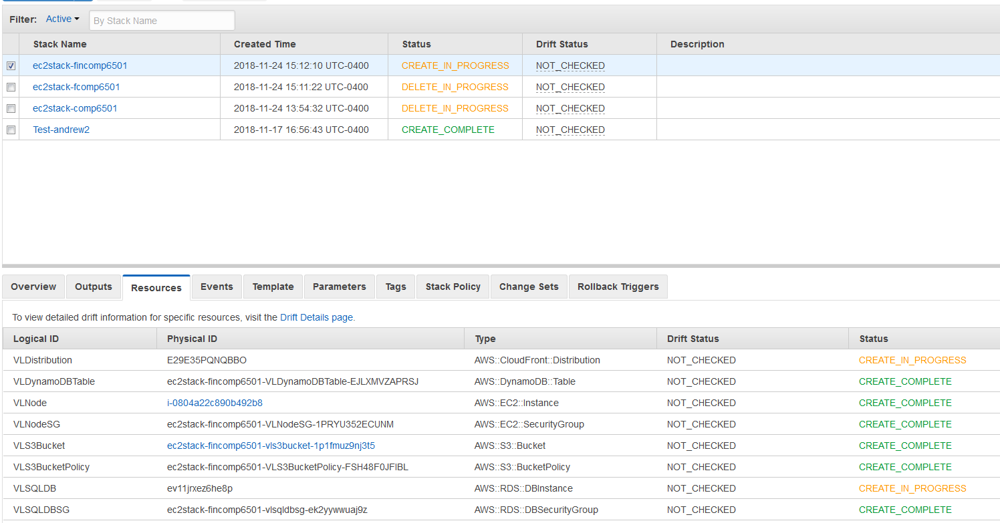
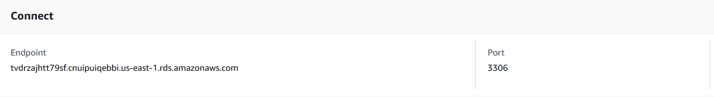
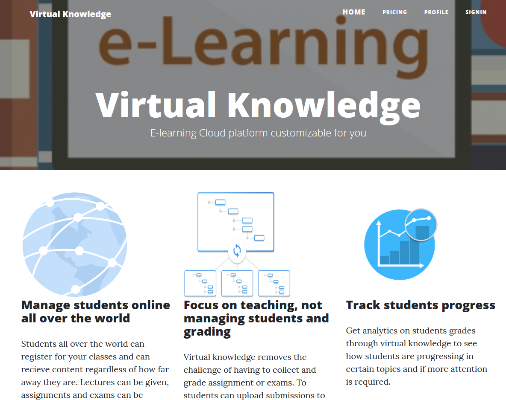

# E Learning Cloud Test platform
This is a cloud E-Learning platform designed for COMP 6905 - Cloud Technologies. It was desinged by:

* Kerschel James
* Gerard Rique
* Andrew Singh

# Instructions
All the commands used in this is located in the commands.sh file for easy copying and referencing.
* Clone or download the repository
* Spin up the resources by doing the following:
  * Create a new Keypair on the EC2 Console (us-east-1)
  * Move key file to the git directory
  * Change the permission of the file to read only (chmod 400 *keypair filename* )
  * Open the deployment.yml and replace [KeyName] with the one you just created (no .pem is necessary).
  * Run the following command from the directory of the deployment.yml (replace <your name>):
   aws cloudformation create-stack --stack-name ec2stack-*your name* --region us-east-1 --template-body file://$PWD/deployment.yml
  * Navigate to the CloudFormation front end and view resources being created using the stackID.

* Select the Resources Tab and select the VLSQLDB instance.
* Scroll down until you see the endpoint url.
* In the app.yml file replace the DATABASE_HOST with the endpoint url.
 
* Go back the the Cloudformation and navigate to the EC2 Instance craeated.
* Look for the IPv4 creaated.
* run the command docker-compose  -H tcp://*EC2 Instance IPv4*:2375 -f app.yml up -d
* (Optional) To view the container made run the command docker  -H tcp://*EC2 Instance IP* ps -a
  
* Navigate to http://*EC2 Instance IP*:8080
  

# Clean up
After running the instructions and testing the site to bring everything down use the following commands:
* docker-compose -H tcp://*EC2 Instance IPv4*:2375 -f app.yml down
* aws cloudformation delete-stack --stack-name ec2stack-*your name* --region us-east-1 
